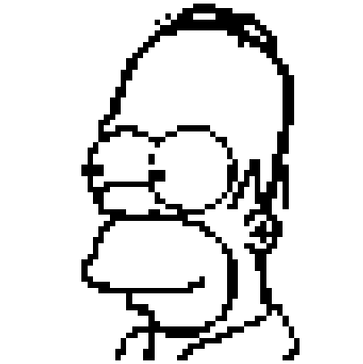
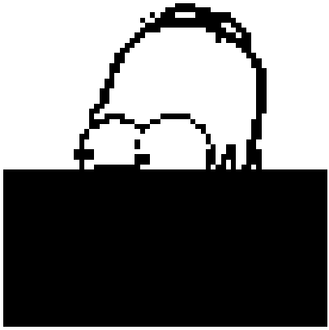
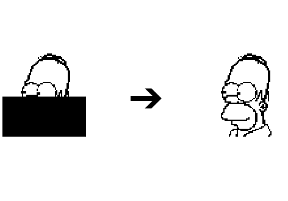
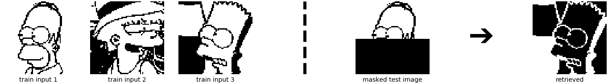
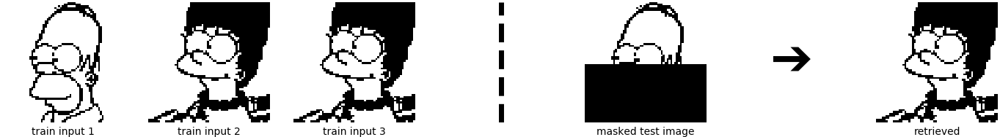
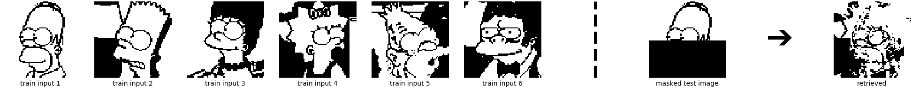

This blog post explains the paper [Hopfield Networks is All You Need][arxiv-paper] and the corresponding new PyTorch [Hopfield layer][github-repo].

## Main contributions
We introduce a new energy function and a corresponding new update rule which is guaranteed to converge to a local minimum of the energy function.

The new energy function is a generalization (discrete states $$\Rightarrow$$ continuous states) of **modern Hopfield Networks** aka **Dense Associative Memories** introduced by [Krotov and Hopfield][krotov-paper] and [Demircigil et al.][demircigil-paper]
The new modern Hopfield Network with continuous states keeps the characteristics of its discrete counterparts:
- exponential storage capacity
- extremely fast convergence

Surprisingly, the new update rule is the attention mechanism of transformer networks introduced in [Attention Is All You Need][vaswani-paper].
We use these new insights to analyze transformer models in the paper. 

## What this blog post is about

This blog post is split into three parts. First, we make the transition from traditional Hopfield Networks towards **modern Hopfield Networks** and their generalization to continuous states through our **new energy function**. Second, the properties of our new energy function and the connection to the self-attention mechanism of transformer networks is shown. Finally, we introduce and explain a new PyTorch layer ([Hopfield layer][github-repo]), which is built on the insights of our work. We show several practical use cases, i.e. [Modern Hopfield Networks and Attention for Immune Repertoire Classification][deepRC-paper], Hopfield pooling, and associations of two sets.

## From classical Hopfield Networks to self-attention

**Associative memories** are one of the earliest artificial neural models dating back to the 1960s and 1970s. Best known are [Hopfield Networks][hopfield-paper], presented by John Hopfield in 1982.
As the name suggests, the main purpose of associative memory networks is to associate an input with its most similar pattern. In other words, the purpose is to store and retrieve patterns.
We start with a review of classical Hopfield Networks. 

### Hopfield Networks

The simplest associative memory is just a **sum of outer products** of the $$N$$ patterns $$\{\boldsymbol{x}_i\}_{i=1}^N$$ that we want to store (Hebbian learning rule). In classical Hopfield Networks these patterns are polar (binary), i.e. $$\boldsymbol{x}_i \in \{ -1,1 \}^d$$, where $$d$$ is the length of the patterns. The corresponding weight matrix $$\boldsymbol{W}$$ is:

$$
\begin{equation}
\boldsymbol{W} = \sum_i^N \boldsymbol{x}_i \boldsymbol{x}_i^T \ . \tag{1}
\end{equation}
$$

The weight matrix $$\boldsymbol{W}$$ stores the patterns, which can be retrieved starting with a **state pattern** $$\boldsymbol{\xi}$$.

---
**Nomenclature**

From now on we denote the $$N$$ **stored patterns** as $$\{\boldsymbol{x}_i\}_{i=1}^N$$ and any **state pattern** or **state** as $$\boldsymbol{\xi}$$.

---

The basic **synchronuous update rule** is to repeatedly multiply the state pattern $$\boldsymbol{\xi}$$ with the weight matrix $$\boldsymbol{W}$$, subtract the bias and take the sign:

$$
\begin{equation}
\boldsymbol{\xi^{t+1}} =  \text{sgn}(\boldsymbol{W}\boldsymbol{\xi}^t - \boldsymbol{b}) \ , \tag{2}
\label{eq:restorage}
\end{equation}
$$

where $$\boldsymbol{b} \in \mathbb{R}^d$$ is a bias vector, which can be interpreted as threshold for every component.
The **asynchronous update rule** performs this update only for one component of $$\boldsymbol{\xi}$$ and then selects the next component for update.
Convergence is reached if $$\boldsymbol{\xi^{t+1}} = \boldsymbol{\xi^{t}}$$. 

The asynchronous version of the update rule of Eq. \eqref{eq:restorage} minimizes the **energy function** $$\text{E}$$:

$$
\begin{equation}
\text{E} = -\frac{1}{2}\boldsymbol{\xi}^T \boldsymbol{W} \boldsymbol{\xi} + \boldsymbol{\xi}^T\boldsymbol{b} = -\frac{1}{2} \sum_{i=1}^d\sum_{j=1}^d w_{ij}\xi_i\xi_j + \sum_{i=1}^d b_i\xi_i \ . \tag{3}
\label{eq:energy_hopfield}
\end{equation}
$$

As derived in the papers of [Bruck][bruck-paper], [Goles-Chacc et al.][goles-chacc-paper] and [the original Hopfield paper][hopfield-paper], the convergence properties are dependent on the structure of the weight matrix $$\boldsymbol{W}$$ and the method by which the nodes are updated:

- For asynchronous updates with $$w_{ii} \geq 0$$ and $$w_{ij} = w_{ji}$$, the updates converge to a stable state.
- For synchronous updates with $$w_{ij} = w_{ji}$$, the updates converge to a stable state or a limit cycle of length 2.

For the asynchronous update rule and symmetric weights, $$\text{E}(\boldsymbol{\xi}^{t+1}) \leq \text{E}(\boldsymbol{\xi}^{t})$$ holds. When $$\text{E}(\boldsymbol{\xi}^{t+1}) = \text{E}(\boldsymbol{\xi}^{t})$$ for the update of every component of $$\boldsymbol{\xi}^t$$, a local minimum in $$\text{E}$$ is reached.
All stored patterns $$\{\boldsymbol{x}_i\}_{i=1}^N$$ should be fixed points of the Hopfield Network, i.e.

$$
\begin{equation}
\boldsymbol{x}_i = \text{sgn}(\boldsymbol{W}\boldsymbol{x}_i - \boldsymbol{b}) \ . \tag{4}
\end{equation}
$$

They should even be local minima of $$\text{E}$$.

In the following example, no bias vector is used. This means that taking the inverse image, i.e. flipping all pixels at once, results in the same energy.

We start with an **illustrative example** of a Hopfield Network. **One input image** should first be stored and then be retrieved.
The input image is:

{:refdef: style="text-align: center;"}
{:width="300px"}
{: refdef}

Since an associative memory has **polar states and patterns** (or binary states and patterns), we convert the input image to a black and white image:

{:refdef: style="text-align: center;"}
{:width="300px"}
{: refdef}

The **weight matrix** $$\boldsymbol{W}$$ is the outer product of this black and white image $$ \boldsymbol{x}_{\text{Homer}} $$:

$$
\begin{equation}
\boldsymbol{W} = \boldsymbol{x}_{\text{Homer}} \boldsymbol{x}_{\text{Homer}}^T \ , \qquad \boldsymbol{x}_{\text{Homer}} \in \{ -1,1\}^d \ , \tag{5}
\label{eq:weight_matrix}
\end{equation}
$$

where for this example $$d = 64 \times 64$$.

Can the original image be restored if half of the pixels are masked out? The masked image is:

{:refdef: style="text-align: center;"}
{:width="300px"}
{: refdef}

which is our inital state $$\boldsymbol{\xi}$$. This inital state is updated via multiplication with the weight matrix $$\boldsymbol{W}$$.
It takes one update until the original image is restored.

{:refdef: style="text-align: center;"}
{:width="600px"}
{: refdef}

What happens if we store **more than one pattern**? The weight matrix is then built from the sum of outer products of **three stored patterns** (three input images):

$$
\begin{equation}
\boldsymbol{W} = \sum_{i=1}^3 \boldsymbol{x}_i \boldsymbol{x}_i^T \ , \qquad \boldsymbol{x}_i \in \{ -1,1\}^d \ . \tag{6}
\end{equation}
$$

{:refdef: style="text-align: center;"}

{: refdef}

{:refdef: style="text-align: center;"}

{: refdef}

In this figure, the left hand side shows the three stored patterns, and the right hand side shows masked state patterns $$\boldsymbol{\xi}$$ together with the retrieved patterns $$\boldsymbol{\xi}^{\text{new}}$$.

Looking at the upper row of images might suggest that the retrieval process is no longer perfect. But there are two interesting facts to take into account:
- Masking the original images introduces many pixel values of $$-1$$. We therefore have the odd behavior that the inner product $$\langle\boldsymbol{x}_{\text{Homer}}^{\text{masked}},\boldsymbol{x}_{\text{Bart}}\rangle$$ is larger than the inner product $$\langle\boldsymbol{x}_{\text{Homer}}^{\text{masked}},\boldsymbol{x}_{\text{Homer}}\rangle$$.
- As stated above, if no bias vector is used, the inverse of the pattern, i.e. flipping all pixels at once, results in the same energy.

Although the retrieval of the upper image looks incorrect, it is de facto correct. However, for the lower row example, the retrieval is no longer correct.
The weights of $$2 \cdot \boldsymbol{x}_{\text{Marge}}$$ have simply overwritten the weights of $$\boldsymbol{x}_{\text{Homer}}$$.
For both examples, only the retrieval after the first update step is shown, but the results do not change when performing further update steps.
The next figure shows the Hopfield Network retrieval for 6 patterns.

{:refdef: style="text-align: center;"}

{: refdef}

Clearly, retrieving the patterns is imperfect. One might suspect that the limited storage capacities of Hopfield Networks, see [Amit et al.][amit-paper] and [Torres et al][torres-paper], is the problem.
However, we show now that the storage capacity is not directly responsible for the imperfect retrieval.
The storage capacity for **retrieval of patterns free of errors** is:

$$
\begin{equation}
C \cong \frac{d}{2\log(d)} \ , \tag{7}
\label{eq:storage_hopfield}
\end{equation}
$$

where $$d$$ is the dimension of the input.

The storage capacity for **retrieval of patterns with a small percentage of errors** is:

$$
\begin{equation}
C \cong 0.14 d\ . \tag{8}
\label{eq:storage_hopfield2}
\end{equation}
$$

In the example, the storage capacity is $$C \cong 0.14 d = 0.14 \cdot 64 \cdot 64 \sim 570 $$.
Thus, insufficient storage capacity is not directly responsible for the retrieval errors.
Instead, the example patterns are correlated, therefore the retrieval has errors.

Consequently, we need a model which **allows pulling apart close patterns**, such that (strongly) **correlated patterns can be distinguished**.

---
**On storage capacity**

The storage capacities stated in Eq. \eqref{eq:storage_hopfield} and in Eq. \eqref{eq:storage_hopfield2} are derived for $$w_{ii}=0$$.
Recently, [Folli et al.][folli-paper] analyzed the storage capacity for Hopfield Networks with $$w_{ii}\geq 0$$. Also for $$w_{ii}\geq 0$$, a storage capacity of $$C \cong 0.14 d$$
for retrieval of patterns with a small percentage of errors was observed. The ratio $$C/d$$ is often called **load parameter** and denoted by $$\alpha$$. [Folli et al.][folli-paper] showed that there is a second regime with very large $$\alpha$$, where the storage capacity is much higher, i.e. more fixed points exist. However, [Rocci et al.][rocchi-paper] and [Gosti et al.][gosti-paper] reported that these fixed points for very large $$\alpha$$ are unstable and do not have an attraction basin.

---

### Modern Hopfield Networks (aka Dense Associative Memories)

The storage capacity is a crucial characteristic of Hopfield Networks. **Modern Hopfield Networks** (aka Dense Associative Memories) introduce a new energy function instead of the energy in Eq. \eqref{eq:energy_hopfield} to create a higher storage capacity. **Discrete** modern Hopfield Networks have been introduced first by [Krotov and Hopfield][krotov-paper] and then generalized by [Demircigil et al][demircigil-paper]:
- [Krotov and Hopfield][krotov-paper] introduced the energy function:

$$
\begin{equation}
\text{E} = -\sum_{i=1}^N F(\boldsymbol{x_i}^T\boldsymbol{\xi}) \ , \tag{9}
\label{eq:energy_krotov2}
\end{equation}
$$

&nbsp;&nbsp;&nbsp;&nbsp;&nbsp;&nbsp;&nbsp; where $$F$$ is an interaction function and $$N$$ is again the number of stored patterns. 

&nbsp;&nbsp;&nbsp;&nbsp;&nbsp;&nbsp;&nbsp; They choose a polynomial interaction function $$F(z)=z^a$$.

&nbsp;&nbsp;&nbsp;&nbsp;&nbsp;&nbsp;&nbsp; The storage capacity for **retrieval of patterns free of errors** is:

$$
\begin{equation}
C \cong \frac{1}{2(2a-3)!!} \frac{d^{a-1}}{\log(d)} \ . \tag{10}
\label{eq:storage_krotov}
\end{equation}
$$

&nbsp;&nbsp;&nbsp;&nbsp;&nbsp;&nbsp;&nbsp; The storage capacity for **retrieval of patterns with a small percentage of errors** is:

$$
\begin{equation}
C \cong \alpha_{a} d^{a-1} \ , \tag{11}
\label{eq:storage_krotov2}
\end{equation}
$$

&nbsp;&nbsp;&nbsp;&nbsp;&nbsp;&nbsp;&nbsp; where $$\alpha_a$$ is a constant, which depends on an (arbitrary) threshold on the error probability.

&nbsp;&nbsp;&nbsp;&nbsp;&nbsp;&nbsp;&nbsp; For $$a=2$$, the classical Hopfield model (Hopfield 1982) is obtained with the storage capacity

&nbsp;&nbsp;&nbsp;&nbsp;&nbsp;&nbsp;&nbsp; of $$C \cong 0.14d$$ for retrieval of patterns with a small percentage of errors.

- [Demircigil et al.][demircigil-paper] extended the energy function by using an exponential interaction function $$F(z)=\text{exp}(z)$$:

$$
\begin{equation}
\text{E} = -\sum_{i=1}^N \text{exp}(\boldsymbol{x}_i^T\boldsymbol{\xi}) \ , \tag{12}
\label{eq:energy_demircigil}
\end{equation}
$$

&nbsp;&nbsp;&nbsp;&nbsp;&nbsp;&nbsp;&nbsp; where $$N$$ is again the number of stored patterns.

&nbsp;&nbsp;&nbsp;&nbsp;&nbsp;&nbsp;&nbsp; Eq. \eqref{eq:energy_demircigil} can also be written as:

$$
\begin{equation}
\text{E} = -\text{exp}\big( \text{lse}(1,\boldsymbol{X}^T \boldsymbol{\xi}) \big) \ , \tag{13}
\label{eq:energy_demircigil2}
\end{equation}
$$

&nbsp;&nbsp;&nbsp;&nbsp;&nbsp;&nbsp;&nbsp; where $$\boldsymbol{X} = (\boldsymbol{x}_1, \ldots, \boldsymbol{x}_N)$$ is the data matrix (matrix of stored patterns).

&nbsp;&nbsp;&nbsp;&nbsp;&nbsp;&nbsp;&nbsp; The *log-sum-exp function* (lse) is defined as:

$$
\begin{equation}
\text{lse}(\beta, \boldsymbol{z}) = \beta^{-1} \log \bigg( \sum_{l=1}^N \text{exp}(\beta z_l) \bigg) \ . \tag{14} 
\end{equation}
$$

&nbsp;&nbsp;&nbsp;&nbsp;&nbsp;&nbsp;&nbsp; This energy function leads to the storage capacity:

$$
\begin{equation}
C \cong 2^{\frac{d}{2}} \ . \tag{15}
\label{eq:storage_demircigil}
\end{equation}
$$

We now look at the **update rule**, which is valid for both Eq. \eqref{eq:energy_krotov2} as well as Eq. \eqref{eq:energy_demircigil}.
For polar patterns, i.e. $$\boldsymbol{\xi} \in \{ -1, 1\}^d$$, we denote the $$l$$-th component by $$\boldsymbol{\xi}[l]$$. Using the energy function of Eq. \eqref{eq:energy_krotov2} or Eq. \eqref{eq:energy_demircigil},
the update rule for the $$l$$-th component $$\boldsymbol{\xi}[l]$$ is described by the difference of the energy of the current state $$\boldsymbol{\xi}$$ and the state with the component $$\boldsymbol{\xi}[l]$$ flipped. The component $$\boldsymbol{\xi}[l]$$ is updated to decrease the energy. 
 The update rule is: 

$$
\begin{equation}
\boldsymbol{\xi}^{\text{new}}[l] =  \text{sgn}\bigg[-\text{E}\big(\boldsymbol{\xi}^{(l+)} \big) + \text{E}\big(\boldsymbol{\xi}^{(l-)} \big) \bigg] \ , \tag{16}
\end{equation}
$$

which is (e.g. for Eq. \eqref{eq:energy_demircigil})

$$
\begin{equation}
\boldsymbol{\xi}^{\text{new}}[l] =  \text{sgn}\bigg[\sum_{i=1}^N \text{exp}\big(\boldsymbol{x}_i^T ~ \boldsymbol{\xi}^{(l+)} \big) - \sum_{i=1}^N \text{exp}(\boldsymbol{x}_i^T ~ \boldsymbol{\xi}^{(l-)} \big)  \bigg] \ , \tag{17}
\label{eq:restorage_demircigil}
\end{equation}
$$

where $$\boldsymbol{\xi}^{(l+)}[l] = 1$$ and $$\boldsymbol{\xi}^{(l-)}[l] = -1$$ and $$ \boldsymbol{\xi}^{(l+)}[k] = \boldsymbol{\xi}^{(l-)}[k] = \boldsymbol{\xi}[k]$$ for $$k \neq l$$. 

In the paper of [Demircigil et al.][demircigil-paper], it is shown that the **update rule**, which minimizes the energy function of Eq. \eqref{eq:energy_demircigil}, converges with high probability after one (asynchronous) update of the current state $$\boldsymbol{\xi}$$. Note that one update of the current state $$\boldsymbol{\xi}$$ corresponds to $$d$$ asynchronous update steps, i.e. one update for each of the $$d$$ single components $$\boldsymbol{\xi}[l]$$ ($$l = 1,\ldots,d$$).

In contrast to classical Hopfield Networks, modern Hopfield Networks do not have a weight matrix as it is defined in Eq. \eqref{eq:weight_matrix}. Instead, the energy function is the **sum of a function of the dot product** of every stored pattern $$\boldsymbol{x}_i$$ with the state pattern $$\boldsymbol{\xi}$$.

Using Eq. \eqref{eq:restorage_demircigil}, we again try to retrieve Homer out of the 6 stored patterns. Compared to the classical Hopfield Network, it now works smoothly, not only for 6 patterns but also for many more:
- First we store the same 6 patterns as above:

{:refdef: style="text-align: center;"}

{: refdef}

- Next we increase the number of stored patterns to 24:

{:refdef: style="text-align: center;"}

{: refdef}

Compared to the traditional Hopfield Networks, the **increased storage capacity now allows pulling apart close patterns**. We are now able to distinguish (strongly) correlated patterns, and can retrieve one specific pattern out of many.

### New energy function for continuous-valued patterns and states

We generalize the energy function of Eq. \eqref{eq:energy_demircigil2} to continuous-valued patterns. We use the logarithm of the negative energy Eq. \eqref{eq:energy_demircigil2} and add a quadratic term. The quadratic term ensures that the norm of the state $$\boldsymbol{\xi}$$ remains finite. The **new energy function** is defined as: 

$$
\begin{equation}
\text{E} = -\text{lse}\big(\beta,\boldsymbol{X}^T\boldsymbol{\xi}\big) + \frac{1}{2} \boldsymbol{\xi}^T\boldsymbol{\xi} + \beta^{-1}\log N + \frac{1}{2} M^2 \ , \tag{18}
\end{equation}
\label{eq:energy_sepp}
$$

which is constructed from $$N$$ **continuous** stored patterns by the matrix $$\boldsymbol{X} = (\boldsymbol{x}_1, \ldots, \boldsymbol{x}_N)$$, where $$M$$ is the largest norm of all stored patterns.

According to the [new paper of Krotov and Hopfield][krotov-arxiv-new], the stored patterns $$\boldsymbol{X}^T$$ of our modern Hopfield Network can be viewed as weights from $$\boldsymbol{\xi}$$ to hidden units, while $$\boldsymbol{X}$$ can be viewed as weights from the hidden units to $$\boldsymbol{\xi}$$. With this interpretation we do not store patterns, but use only weights in our model as in the classical Hopfield Network.

The energy function of Eq. \eqref{eq:energy_sepp} allows deriving an update rule for a state pattern $$\boldsymbol{\xi}$$ by the **Concave-Convex-Procedure** (CCCP), which is described by [Yuille and Rangarajan][CCCP-paper]. 

- the total energy $$\text{E}(\boldsymbol{\xi})$$ is split into a convex and a concave term: $$\text{E}(\boldsymbol{\xi}) = \text{E}_1(\boldsymbol{\xi}) + \text{E}_2(\boldsymbol{\xi})$$
- the term $$\frac{1}{2} \boldsymbol{\xi}^T\boldsymbol{\xi} + C = \text{E}_1(\boldsymbol{\xi})$$ is convex ($$C$$ is a constant independent of $$\boldsymbol{\xi}$$) 
- the term $$-\text{lse}\big(\beta,\boldsymbol{X}^T\boldsymbol{\xi}\big) = \text{E}_2(\boldsymbol{\xi})$$ is concave (lse is convex since its Hessian is positive semi-definite, which is shown in the appendix of the paper) 
- The CCCP applied to $$\text{E}$$ is:

$$
\begin{equation}
\nabla_{\boldsymbol{\xi}}\text{E}_1(\boldsymbol{\xi}^{t+1}) = - \nabla_{\boldsymbol{\xi}}\text{E}_2(\boldsymbol{\xi}^{t}) \tag{19}
\label{eq:update_sepp1}
\end{equation}
$$

$$
\begin{equation}
\nabla_{\boldsymbol{\xi}}\left( \frac{1}{2}\boldsymbol{\xi}^T\boldsymbol{\xi} + C \right)(\boldsymbol{\xi}^{t+1}) = \nabla_{\boldsymbol{\xi}} \text{lse}\big(\beta,\boldsymbol{X}^T\boldsymbol{\xi}^t\big) \tag{20}
\label{eq:update_sepp2}
\end{equation}
$$

$$
\begin{equation}
\boldsymbol{\xi}^{t+1} = \boldsymbol{X}\text{softmax}\big(\beta \boldsymbol{X}^T \boldsymbol{\xi}^t \big) \ , \tag{21}
\label{eq:update_sepp3}
\end{equation}
$$

where $$\nabla_{\boldsymbol{\xi}} \text{lse}\big(\beta,\boldsymbol{X}^T\boldsymbol{\xi}\big) = \boldsymbol{X}\text{softmax}\big(\beta \boldsymbol{X}^T \boldsymbol{\xi} \big)$$.

The update rule for a state pattern $$\boldsymbol{\xi}$$ therefore reads:

$$
\begin{equation}
\boldsymbol{\xi}^{\text{new}} = \boldsymbol{X}\text{softmax}\big(\beta \boldsymbol{X}^T \boldsymbol{\xi} \big) \ . \tag{22}
\label{eq:update_sepp4}
\end{equation}
$$

Having applied the Concave-Convex-Procedure to obtain the update rule guarantees the monotonical decrease of the energy function.

The most important **properties of our new energy function** are:
1. Global convergence to a local minimum (Theorem 2 in the paper)
2. Exponential storage capacity (Theorem 3 in the paper)
3. Convergence after one update step (Theorem 4 in the paper)

Exponential storage capacity and convergence after one update are inherited from [Demircigil et al.][demircigil-paper]
Global convergence to a local minimum means that all limit points that are generated by the iteration of Eq. \eqref{eq:update_sepp4} are stationary points (local minima or saddle points) of the energy function of Eq. \eqref{eq:energy_sepp} (almost surely no maxima are found, saddle points were never encountered in any experiment).

The new continuous energy function allows **extending our example to continuous patterns**. In the following, we are going to retrieve a continuous Homer out of many continuous stored patterns using Eq. \eqref{eq:update_sepp4}. First we have to convert the input images into grey scale images:

{:refdef: style="text-align: center;"}
{:width="300px"}
{: refdef}

Next, we conduct the same experiment as above, but now in continuous form:

{:refdef: style="text-align: center;"}

{: refdef}

We again see that Homer is perfectly retrieved. We have considered the case where the patterns are sufficiently different from each other, and consequently the iterate converges to a fixed point which is near to one of the stored patterns.
However, if some stored patterns are similar to each other, then a **metastable state** near the similar patterns appears. Iterates that start near this metastable state or at one of the similar patterns converge to this metastable state. The **learning dynamics can be controlled by the inverse temperature $$\beta$$**, see Eq. \eqref{eq:update_sepp4}. High values of $$\beta$$ correspond to a low temperature and mean that the attraction basins of the individual patterns remain separated and it is unlikely that metastable states appear. Low values of $$\beta$$ on the other hand correspond to a high temperature and the formation of metastable states becomes more likely. We now look at the same example, but instead of $$\beta = 8$$, we use $$\beta= 0.5$$. The retrieved state is now a superposition of multiple stored patterns.

{:refdef: style="text-align: center;"}

{: refdef}

To make this more explicit, we have a closer look how the results are changing if we retrieve with different values of $$\beta$$:

{:refdef: style="text-align: center;"}

{: refdef}

 

### The update of the new energy function is the self-attention of transformer networks

Starting with Eq. \eqref{eq:update_sepp3}, and
1. generalizing the new update rule to multiple patterns at once,
2. mapping the patterns to an associative space,
3. projecting the result,

we arrive at the **(self-)attention of transformer networks**.
Next, we will guide through these three steps.

For $$S$$ state patterns $$\boldsymbol{\Xi} = (\boldsymbol{\xi}_1, \ldots, \boldsymbol{\xi}_S)$$, Eq. \eqref{eq:update_sepp3} can be generalized to:

$$
\begin{equation}
\boldsymbol{\Xi}^{\text{new}} = \boldsymbol{X}\text{softmax}\big(\beta \boldsymbol{X}^T \boldsymbol{\Xi} \big) \ . \tag{23} 
\label{eq:update_generalized}
\end{equation}
$$

We first consider $$\boldsymbol{X}^T$$ as $$N$$ *raw stored patterns* $$\boldsymbol{Y} = (\boldsymbol{y}_1,\ldots,\boldsymbol{y}_N)^T$$, which are mapped to an associative space via $$\boldsymbol{W}_K$$, and $$\boldsymbol{\Xi}^T$$ as $$S$$ *raw state patterns* $$\boldsymbol{R} = (\boldsymbol{\xi}_1,\ldots,\boldsymbol{\xi}_S)^T$$, which are mapped to an associative space via $$\boldsymbol{W}_Q$$.

Setting

$$
\begin{equation}
\boldsymbol{Q} = \boldsymbol{\Xi}^T = \boldsymbol{R} \boldsymbol{W}_Q \ , \tag{24}
\label{eq:mapping_Q}
\end{equation}
$$

$$
\begin{equation}
\boldsymbol{K} = \boldsymbol{X}^T = \boldsymbol{Y} \boldsymbol{W}_K \ , \tag{25}
\label{eq:mapping_K}
\end{equation}
$$

$$
\begin{equation}
\beta = \frac{1}{\sqrt{d_k}} \ , \tag{26}
\end{equation}
$$

we obtain:

$$
\begin{equation}
\big( \boldsymbol{Q}^{\text{new}} \big)^T = \boldsymbol{K}^T \text{softmax}\left( \frac{1}{\sqrt{d_k}} \boldsymbol{K} \boldsymbol{Q}^T \right) \ . \tag{27} 
\label{eq:update_generalized2}
\end{equation}
$$

In Eq. \eqref{eq:mapping_Q} and Eq. \eqref{eq:mapping_K}, $$\boldsymbol{W}_Q$$ and $$\boldsymbol{W}_K$$ are matrices which map the respective patterns into the associative space.
Note that in Eq. \eqref{eq:update_generalized2}, the softmax is applied column-wise to the matrix $$\boldsymbol{K} \boldsymbol{Q}^T$$.

Next, we simple transpose Eq. \eqref{eq:update_generalized2}, which also means that the softmax is now applied row-wise to its transposed input $$\boldsymbol{Q} \boldsymbol{K}^T$$, and obtain:

$$
\begin{equation}
\boldsymbol{Q}^{\text{new}} = \text{softmax}\left( \frac{1}{\sqrt{d_k}} \boldsymbol{Q} \boldsymbol{K}^T \right) \boldsymbol{K} \ . \tag{28} 
\label{eq:update_generalized3}
\end{equation}
$$

Now, we only need to project $$\boldsymbol{Q}^{\text{new}}$$ via another projection matrix $$\boldsymbol{W}_V$$:

$$
\begin{equation}
\boldsymbol{Z} = \boldsymbol{Q}^{\text{new}} \boldsymbol{W}_V = \text{softmax}\left( \frac{1}{\sqrt{d_k}} \boldsymbol{Q} \boldsymbol{K}^T \right) \boldsymbol{K} \boldsymbol{W}_V = \text{softmax}\left( \frac{1}{\sqrt{d_k}} \boldsymbol{Q} \boldsymbol{K}^T \right) \boldsymbol{V}\ , \tag{29} 
\label{eq:update_generalized4}
\end{equation}
$$

and **voilà, we have obtained the transformer attention**.
If the $$N$$ raw stored patterns $$\boldsymbol{Y} = (\boldsymbol{y}_1, \ldots, \boldsymbol{y}_N)^T$$ are used as raw state patterns $$\boldsymbol{R}$$, we obtain the **transformer self-attention**.

If we resubstitute our raw stored patterns $$\boldsymbol{Y}$$ and our raw state patterns $$\boldsymbol{R}$$, we can rewrite Eq. \eqref{eq:update_generalized4} as

$$
\begin{equation}
\boldsymbol{Z} = \text{softmax}\big(\beta \cdot \boldsymbol{R} \boldsymbol{W}_Q \boldsymbol{W}^T_K \boldsymbol{Y}^T \big) \boldsymbol{Y} \boldsymbol{W}_K \boldsymbol{W}_V \ , \tag{30} 
\label{eq:update_generalized5}
\end{equation}
$$

which is the fundament of our new PyTorch Hopfield layer.

## Versatile Hopfield layer (beyond self-attention)

The insights stemming from our work on modern Hopfield Networks allowed us to introduce a new [PyTorch Hopfield layer][github-repo], which can be used as plug-in replacement for existing layers as well as for applications like multiple instance learning, set-based and permutation invariant learning, associative learning, and many more.

Additional functionalities of the new PyTorch Hopfield layer compared to the transformer (self-)attention layer are:
- **Association of two sets**
- **Variable** $$\beta$$ that determines the kind of fixed points
- **Multiple updates** for precise fixed points
- **Dimension of the associative space** for controlling the storage capacity
- **Static patterns** for fixed pattern search
- **Pattern normalization** to control the fixed point dynamics by norm and shift of the patterns

A sketch of the new Hopfield layer is provided below.

{:refdef: style="text-align: center;"}
{:width="500px"}
{: refdef}

Next, we introduce the underlying mechanisms of the implementation. Based on these underlying mechanisms, we give two examples on how to use the new Hopfield layer and how to utilize the principles of modern Hopfield Networks.

### Hopfield Layer

In its most general form, the result patterns $$\boldsymbol{Z}$$ are a function of raw stored patterns $$\boldsymbol{Y}$$, raw state patterns $$\boldsymbol{R}$$, and projection matrices $$\boldsymbol{W}_Q$$, $$\boldsymbol{W}_K$$, $$\boldsymbol{W}_V$$:

$$
\begin{equation}
\boldsymbol{Z} = f(\boldsymbol{Y}, \boldsymbol{R}, \boldsymbol{W}_Q, \boldsymbol{W}_K, \boldsymbol{W}_V) = \text{softmax}\big(\beta \cdot \boldsymbol{R} \boldsymbol{W}_Q \boldsymbol{W}^T_K \boldsymbol{Y}^T \big) \boldsymbol{Y} \boldsymbol{W}_K \boldsymbol{W}_V \, \tag{31} 
\label{eq:Hopfield_1}
\end{equation}
$$

where we denote 

$$
\begin{equation}
\tilde{\boldsymbol{W}}_V = \boldsymbol{W}_K \boldsymbol{W}_V \ . \tag{32}
\label{eq:Hopfield_2}
\end{equation}
$$

Here, the rank of $$\tilde{\boldsymbol{W}}_V$$ is limited by dimension constraints of the matrix product $$\boldsymbol{W}_K \boldsymbol{W}_V$$.
To provide the Hopfield layer with more flexibility, the matrix product $$\boldsymbol{W}_K \boldsymbol{W}_V$$ can be replaced by one parameter matrix (flag in the code). In this case $$\tilde{\boldsymbol{W}}_V$$ is not the product from Eq. \eqref{eq:Hopfield_2} but a stand-alone parameter matrix as in the original transformer setting. 

In Eq. \eqref{eq:Hopfield_1}, the $$N$$ raw stored patterns $$\boldsymbol{Y}=(\boldsymbol{y}_1,\ldots,\boldsymbol{y}_N)^T$$ and the $$S$$ raw state patterns $$\boldsymbol{R}=(\boldsymbol{r}_1,\ldots,\boldsymbol{r}_S)^T$$ are mapped to an associative space via the matrices $$\boldsymbol{W}_K$$ and $$\boldsymbol{W}_Q$$.
We also allow **static state** and **static stored patterns**. A static pattern means that it does not depend on the network input, i.e. it is determined by the bias weights and remains constant across different network inputs.

An illustration of the matrices of Eq. \eqref{eq:Hopfield_1} is shown below:

{:refdef: style="text-align: center;"}
{:width="800px"}
{: refdef}

Note that in this simplified sketch $$\boldsymbol{W}_V$$ already contains the output projection.

It now depends on the underlying tasks which matrices are used.
For example, the code for the above sketch would be the following: 


hopfield = Hopfield(
    input_size=3,                          # R
    hidden_size=3,
    stored_pattern_size=4,                 # Y
    pattern_projection_size=4,             # Y
    scaling=beta,
    pattern_projection_as_connected=True)  # Eq. (32)

# tuple of stored_pattern, state_pattern, pattern_projection
hopfield((Y, R, Y))


### Hopfield Retrieval

Of course we can also use the new Hopfield layer to solve the pattern retrieval task from above. For this task no trainable weights are needed.

{:refdef: style="text-align: center;"}
{:width="800px"}
{: refdef}


hopfield = Hopfield(
    scaling=beta,

    # do not project layer input
    state_pattern_as_static=True,
    stored_pattern_as_static=True,
    pattern_projection_as_static=True,

    # do not pre-process layer input
    normalize_stored_pattern=False,
    normalize_stored_pattern_affine=False,
    normalize_state_pattern=False,
    normalize_state_pattern_affine=False,
    normalize_pattern_projection=False,
    normalize_pattern_projection_affine=False,

    # do not post-process layer output
    disable_out_projection=True)

# tuple of stored_pattern, state_pattern, pattern_projection
hopfield((Y, R, Y))



### Hopfield Pooling

We consider the Hopfield layer as a pooling layer if only one static state pattern (query) exists. Then, it is de facto a **pooling over the sequence**.
The static state pattern is considered as a **prototype pattern** and consequently learned in the Hopfield pooling layer.
Below we give two examples of a Hopfield pooling over the stored patterns $$\boldsymbol{Y}$$. Note that the pooling always operates over the token dimension (i.e. the sequence length), and not the token embedding dimension.

{:refdef: style="text-align: center;"}
{:width="800px"}
{: refdef}


hopfield_pooling = HopfieldPooling(
    input_size=4,                          # Y
    hidden_size=3,                         # Q
    scaling=beta,
    pattern_projection_as_connected=True)  # Eq. (32)

# stored_pattern and pattern_projection
hopfield_pooling(Y)


The pooling over the sequence is de facto done over the token dimension of the stored patterns, i.e. $$\boldsymbol{Y} \in \mathbb{R}^{(2 \times 4)} \Rightarrow \boldsymbol{Z} \in \mathbb{R}^{(1 \times 4)}$$.

We show another example below, where the Hopfield pooling boils down to $$\boldsymbol{Y} \in \mathbb{R}^{(3 \times 5)} \Rightarrow \boldsymbol{Z} \in \mathbb{R}^{(1 \times 5)}$$:

{:refdef: style="text-align: center;"}
{:width="800px"}
{: refdef}


hopfield_pooling = HopfieldPooling(
    input_siz=5,                           # Y
    hidden_size=3,                         # Q
    scaling=beta,
    pattern_projection_as_connected=True)  # Eq. (32)

# stored_pattern and pattern_projection
hopfield_pooling(Y)


## DeepRC

One SOTA application of modern Hopfield Networks can be found in the paper [Modern Hopfield Networks and Attention for Immune Repertoire Classification][deeprc-paper] by Widrich et al.
Here, the high storage capacity of modern Hopfield Networks is exploited to solve a challenging [multiple instance learning (MIL)][dietterich-paper] problem in computational biology called **immune repertoire classification**.

---
**Biological background**

The immune repertoire of an individual consists of an immensely large number of immune repertoire receptors (and many other things).
The task of these receptors, which can be represented as amino acid sequences with variable length and 20 unique letters, 
is to selectively bind to surface-structures of specific pathogens in order to combat them.
Only a variable sub-sequence of the receptors might be responsible for this binding.
Due to the large variety of pathogens, each human has about [$$10^7$$--$$10^8$$][mora-paper] unique immune receptors with low overlap
across individuals and sampled from a potential diversity of [$$>10^{14}$$][mora-paper] receptors.
However, only very few of these receptors bind to a single specific pathogen.
This means that the immune repertoire of an individual that shows an immune response against a specific pathogen, e.g. a specific disease,
should contain a few sequences that can bind to this specific pathogen.
Turning this around, in order to classify such immune repertoires into those with and without immune response,
one would have to find this variable sub-sequence that binds to the specific pathogen.

---

Consequently, the **classification of immune repertoires is extremely difficult**,
since each immune repertoire contains a large amount of sequences as instances with only a very few of them indicating the correct class by carrying a certain variable sub-sequence.
This is a prominent example of 
a **needle-in-a-haystack** problem and a strong challenge for machine learning methods. 

Based on modern Hopfield networks, a neural network method called **DeepRC** was designed:

{:refdef: style="text-align: center;"}
{:width="800px"}
{: refdef}

DeepRC consists of three parts:
- a sequence-embedding neural network $$h(.)$$ to supply a fixed-sized sequence-representation (e.g. 1D-CNN or LSTM),
- a **Hopfield layer part** for sequence-attention $$f(.)$$, and
- an output neural network and/or fully connected output layer $$o(.)$$.

The sketch below visualizes the **Hopfield layer part**:

{:refdef: style="text-align: center;"}
{:width="500px"}
{: refdef}

It is to note that for immune repertoire classification 
the **number of instances is much larger than the number of features** (**~300k instances per repertoire**).
To be
more precise, the 
difference is a factor of $$10^4$$ to $$10^5$$.
This is indicated in the sketch, where $$\textbf{Y}^T$$ has more columns than rows.

So far we have discussed two use cases of the Hopfield layer: 
(i) the default setting where the **input consists of stored patterns and state patterns** and 
(ii) the Hopfield pooling, where **a prototype pattern** is learned, which means that the vector $$\boldsymbol{Q}$$ is learned. 
For immune repertoire classification we have another use case. 
Now the **inputs** for the Hopfield layer are partly **obtained via neural networks**.

The three ingredients of the attention mechanism of **DeepRC** are:

- the output of the sequence-embedding neural network $$\boldsymbol{Y}^T$$ directly acts as values $$\boldsymbol{V}$$,
- a second neural network, e.g. a [self-normalizing neural network (SNN)][klambauer-paper], shares its first layers with the sequence-embedding neural network and outputs the keys $$\boldsymbol{K}$$, i.e. the stored patterns, and
- similar to the Hopfield pooling operation, the query vector $$\boldsymbol{Q}$$ is learned and represents the variable binding sub-sequence we are looking for.

This results in a complex attention mechanism that is able to deal with the large number of instances,
while keeping the complexity of the input to the output network low.


Y = EmbeddingNN(I)  # e.g. 1D-CNN
K = SNN(Y)
Q = StatePattern(size=3)

hopfield = Hopfield(
    scaling=beta,

    # do not project layer input
    state_pattern_as_static=True,
    stored_pattern_as_static=True, 
    pattern_projection_as_static=True,

    # do not pre-process layer input
    normalize_stored_pattern=False,
    normalize_stored_pattern_affine=False,
    normalize_state_pattern=False,
    normalize_state_pattern_affine=False,
    normalize_pattern_projection=False,
    normalize_pattern_projection_affine=False,

    # do not post-process layer output
    disable_out_projection=True)

# tuple of stored_pattern, state_pattern, pattern_projection
hopfield((K, Q, Y))



## Material

- [Paper: Hopfield Networks is All You Need][arxiv-paper]

- [Githup repo: hopfield-layers][github-repo]

- [Paper: Modern Hopfield Networks and Attention for Immune Repertoire Classification][deeprc-paper]

- [Githup repo: DeepRC][github-repo-deeprc]

- [Yannic Kilcher's video on our two papers][kilcher-video]

## Correspondence

This blog post was written by Johannes Brandstetter: brandstetter[at]ml.jku.at

Contributions by Viet Tran, Bernhard Schäfl, Hubert Ramsauer, Johannes Lehner, Michael Widrich, Günter Klambauer and Sepp Hochreiter.

[jekyll-docs]: https://jekyllrb.com/docs/home
[jekyll-gh]:   https://github.com/jekyll/jekyll
[jekyll-talk]: https://talk.jekyllrb.com/

[arxiv-paper]: https://arxiv.org/abs/2008.02217
[github-repo]: https://github.com/ml-jku/hopfield-layers
[github-repo-deeprc]: https://github.com/ml-jku/DeepRC 
[krotov-paper]: https://arxiv.org/abs/1606.01164
[demircigil-paper]: https://arxiv.org/abs/1702.01929
[vaswani-paper]: https://arxiv.org/abs/1706.03762
[goles-chacc-paper]: https://www.sciencedirect.com/science/article/pii/0166218X85900290
[bruck-paper]: https://ieeexplore.ieee.org/stamp/stamp.jsp?tp=&arnumber=58341
[deepRC-paper]: https://arxiv.org/abs/2007.13505
[hopfield-paper]: https://authors.library.caltech.edu/7427/1/HOPpnas82.pdf
[torres-paper]: https://journals.aps.org/pre/pdf/10.1103/PhysRevE.66.061910
[amit-paper]: https://citeseerx.ist.psu.edu/viewdoc/download?doi=10.1.1.322.3548&rep=rep1&type=pdf
[folli-paper]: https://www.frontiersin.org/articles/10.3389/fncom.2016.00144/full
[rocchi-paper]: https://arxiv.org/abs/1704.07741
[gosti-paper]: https://www.mdpi.com/1099-4300/21/8/726/htm
[CCCP-paper]: https://papers.nips.cc/paper/2125-the-concave-convex-procedure-cccp.pdf
[krotov-arxiv-new]: https://arxiv.org/abs/2008.06996
[dietterich-paper]: https://www.ics.uci.edu/~rickl/publications/1997-aij.pdf
[mora-paper]: https://www.sciencedirect.com/science/article/pii/S2452310019300289
[klambauer-paper]: http://papers.nips.cc/paper/6698-self-normalizing-neural-networks.pdf
[kilcher-video]: https://www.youtube.com/watch?v=nv6oFDp6rNQ
